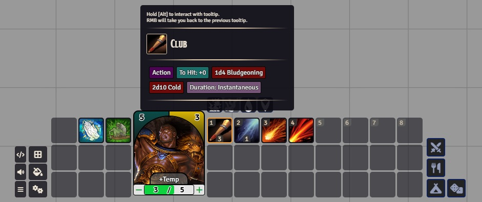

The Token Hotbar module expands the abilities of the basic Macro Hotbar by adding, the ability to roll items, manage resources, and apply temporary effects. The module also allows you to configure the hotbar size and up to 3 resources that can be edited from the hotbar.

The module is configured to support DND5e and PF2e it also provides functions allowing other devs to configure support of other systems.

System specific logic (see 5e support for more details): 
- `actions` - if provided, action buttons will be added to the right of the hotbar
- `filters` - if provided, user will be able to select filters to highlight only specific items in the hotbar
- `autofill` - allows you to analyze the items of a given actor and automatically fill the hotbar with them.
